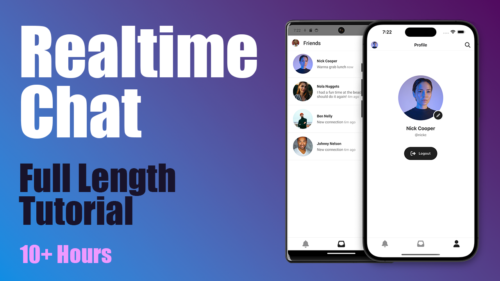

# Realtime Chat

A React Native + Django + Channels real-time communication app tutorial final project.



Youtube playlist link: https://www.youtube.com/playlist?list=PLswiMBSI75YtSVBBKUYY4dC20hQJ7OdAz


## Setup

```
python -m venv venv
venv\Scripts\activate
pip install -r requirements.txt
deactivate
cd chat
yarn install
cd ios
pod install
cd ../..
```

## run redis

```
docker pull redis/redis-stack-server:latest
docker run -d --name redis-stack-server -p 6379:6379 redis/redis-stack-server:latest
```

## run API

```
cd api
python manage.py runserver 0.0.0.0:8000
```
## run chat 

```
open chat in new visual studio
npx react-native run-android   or  npm start
```
# Run

```
# Terminal 1
make server

# Terminal 2
make redis

# Terminal 3
make
```
